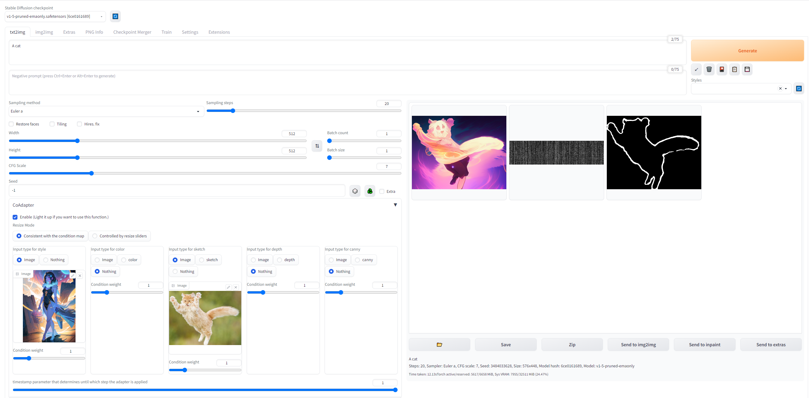

# SD-Webui Extension
This repo is an extension for Composeable T2I-Adapter ([CoAdapter](https://github.com/TencentARC/T2I-Adapter)).

## 🔧 Install
- Install the [stable diffusion webui](https://github.com/AUTOMATIC1111/stable-diffusion-webui).
- Open "Extensions" tab.
- Open "Install from URL" tab in the tab.
- Enter URL of this repo to "URL for extension's git repository".
- Press "Install" button.
- Reload/Restart Web UI.

Once installed, the UI looks like:
<!-- 
 -->

  

## Demos

| Sketch                                                                                                                                    | Canny |                                                                   Depth                                                                   | Color (Spatial) | Style                                                                                                                                      | Results |
|:------------------------------------------------------------------------------------------------------------------------------------------|:-----:|:-----------------------------------------------------------------------------------------------------------------------------------------:|:---------------:|--------------------------------------------------------------------------------------------------------------------------------------------|---------|
|  |       |                                                                                                                                           |                 |  |         |
|  |       |                                                                                                                                           |                 |   |         |
|  |       |  |                 |   |         |
|  |       |  |                 |   |         |

## 🤗 Acknowledgements
- [Stable Diffusion WebUI](https://github.com/AUTOMATIC1111/stable-diffusion-webui)
- [SD WebUI extension for ControlNet and T2I-Adapter](https://github.com/Mikubill/sd-webui-controlnet)
