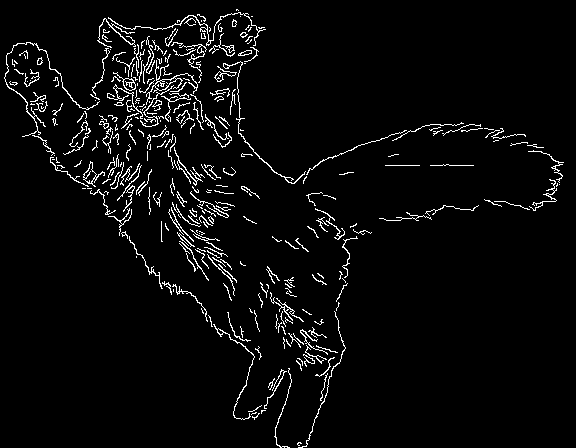
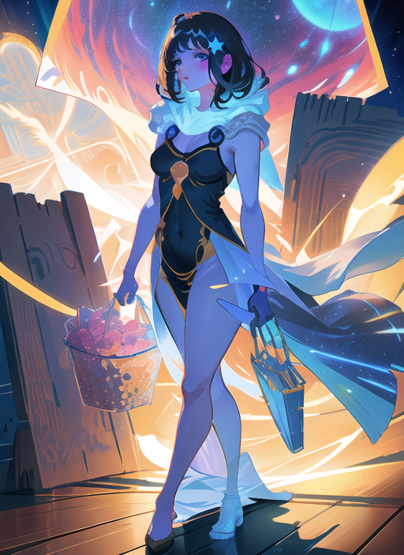
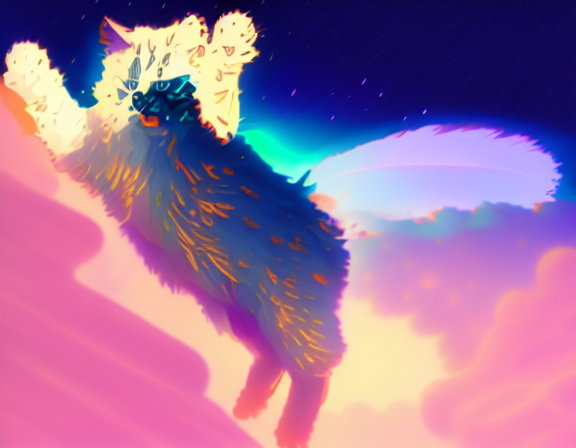
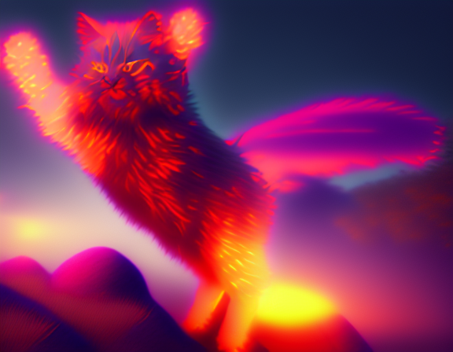
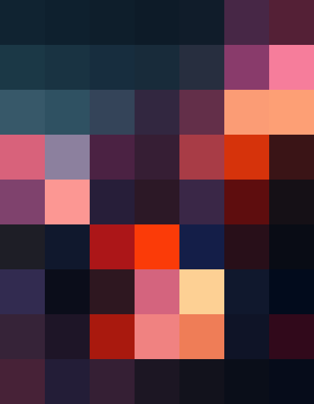
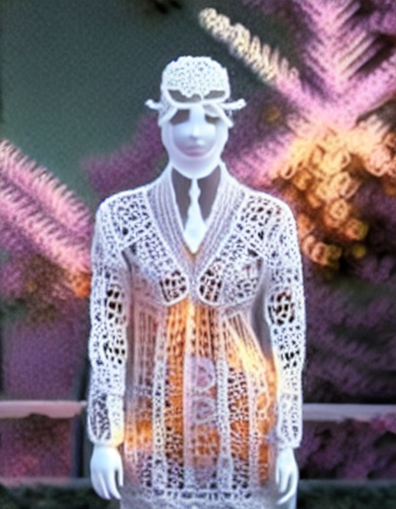
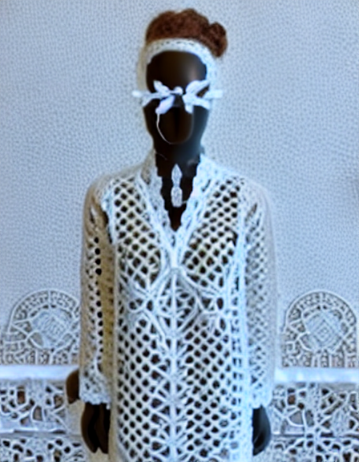

# SD-Webui-CoAdapter
This repo is a SD-Webui extension for Composable T2I-Adapter ([CoAdapter](https://github.com/TencentARC/T2I-Adapter)).

## 🔧 Install
- Install the [stable diffusion webui](https://github.com/AUTOMATIC1111/stable-diffusion-webui).
- Open "Extensions" tab.
- Open "Install from URL" tab in the tab.
- Enter URL of this repo to "URL for extension's git repository".
- Press "Install" button.
- Reload/Restart Web UI.

Once installed, the UI looks like:
<!-- 
 -->

  

## 💻 Usage

**Remember to check ``Enable'' box to activate the function of CoAdapter.**
1. Using functions in "txt2img" or "img2img" tab.
2. Import the conditions you need into the window of Coadapter.
3. Choosing a sampler in the "sampling method". Empirically, DDIM is all-right. 
4. For the output resolution, you can choose "Consistent with the condition map" or "Controlled by resize sliders". 

## ⏬ Download Models
### Linux
Pre-trained models are downloaded automatically from <https://huggingface.co/TencentARC/T2I-Adapter> and placed in the "stable-diffusion-webui\extensions\T2I-Adapter\models" folder. 

### Windows
Downloading models from T2I-Adapter model zoom: https://github.com/TencentARC/T2I-Adapter/blob/main/docs/AdapterZoo.md

**Put models in your "stable-diffusion-webui\extensions\T2I-Adapter\models".

## 🔥🔥🔥 Demos

| Sketch                                                                                                                                    | Canny |                                                                   Depth                                                                   | Color (Spatial) | Style                                                                                                                                      | Results |
|:------------------------------------------------------------------------------------------------------------------------------------------|:-----:|:-----------------------------------------------------------------------------------------------------------------------------------------:|:---------------:|--------------------------------------------------------------------------------------------------------------------------------------------|---------|
|  |       |                                                                                                                                           |                 |  |         |
|  |        |                                                                                                                                           |                 |   |         |
|  |       |  |                 |   |         |
|  |       |  |                 |   |         |
|  |       |  |                |   |         |

## 🤗 Acknowledgements
- [Stable Diffusion WebUI](https://github.com/AUTOMATIC1111/stable-diffusion-webui)
- [SD WebUI extension for ControlNet and T2I-Adapter](https://github.com/Mikubill/sd-webui-controlnet)
- [Composer](https://github.com/damo-vilab/composer)
